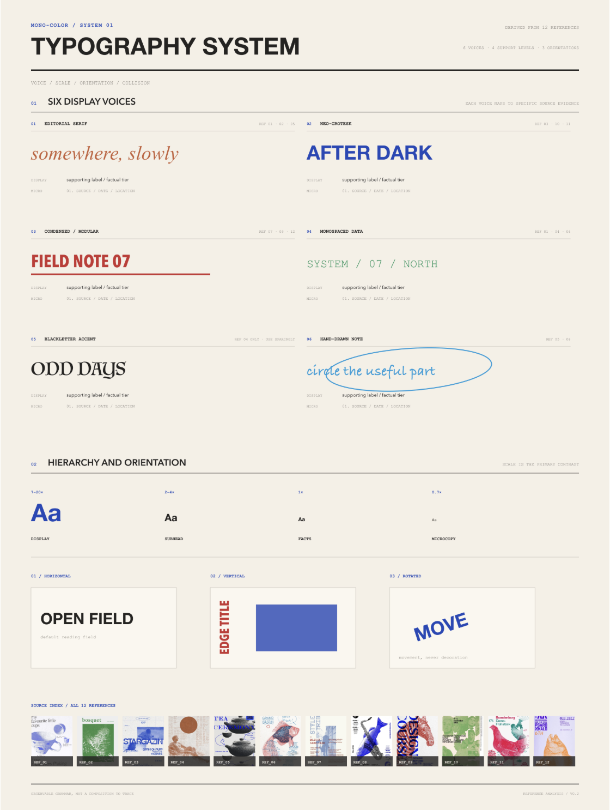
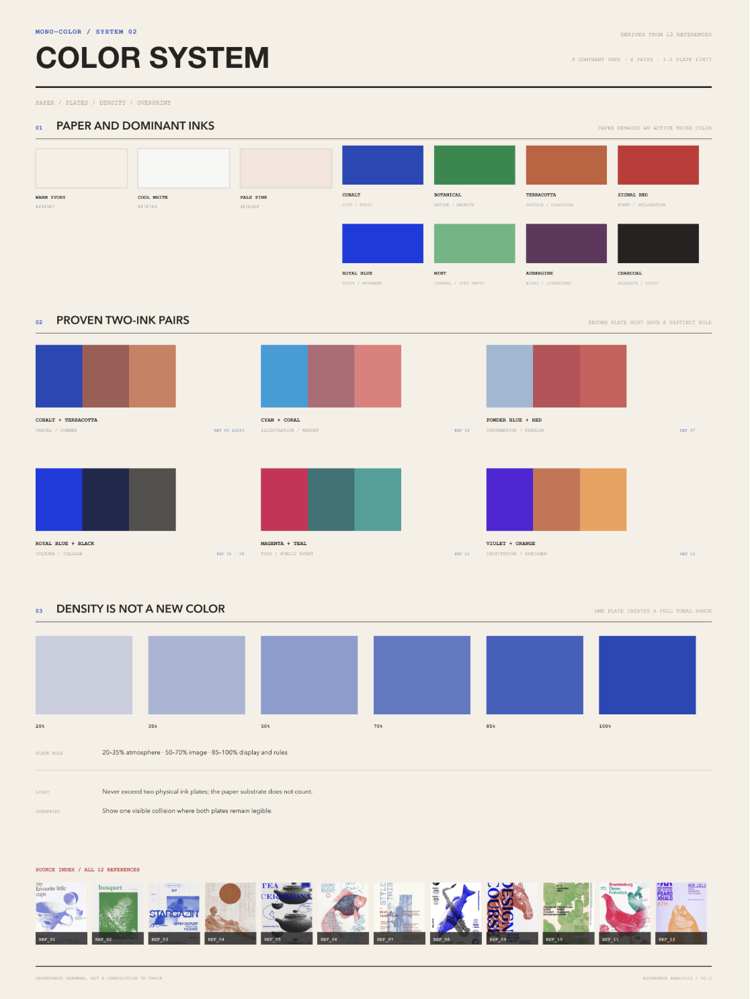
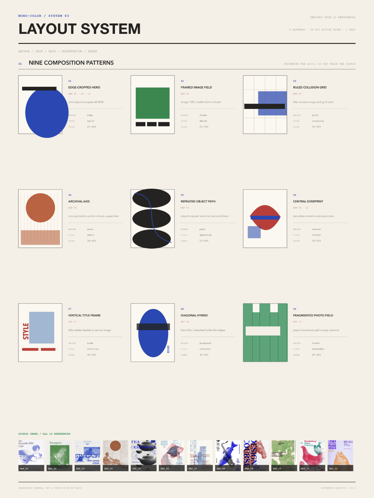
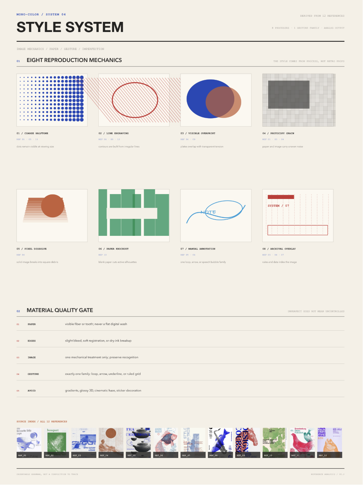

<div align="center">

[中文](./README.zh.md) · **English**

# Monocolor Editorial Print

**A one-ink and controlled two-ink editorial image skill for posters, zines, portraits, packaging, and visual field notes.**

[](./CHANGELOG.md)
[](./skills/mono-color/SKILL.md)
[](https://github.com/yanliudesign/mono-color-skill/stargazers)
[](https://github.com/yanliudesign/mono-color-skill/actions/workflows/validate.yml)

[](https://claude.ai/code)
[](./skills/mono-color/SKILL.md)

</div>

Turn a theme, sentence, object, or supplied photograph into an original editorial image. The skill defaults to controlled two-ink with one dominant plate and one narrowly assigned accent plate. Explicit one-ink or monochrome requests remain pure one-ink. White, cool gray, or pale-beige substrates are selected from the image and palette; contemporary editorial is the default, while vintage treatment appears only when requested.

It preserves a visual system rather than copying a reference. Every composition is rebuilt around the subject, intent, words, and image role.

## Selected examples

| Summer cycling | Field study | Ordinary spaces |
|:---:|:---:|:---:|
|  |  |  |

| Sardine packaging | Headphone packaging | Sunscreen packaging |
|:---:|:---:|:---:|
|  |  |  |

| A little warmth | Brand merchandise | Slow leaf |
|:---:|:---:|:---:|
|  |  |  |

| Night photography | Sunday radio | Night market |
|:---:|:---:|:---:|
|  |  |  |

These original generated examples demonstrate the skill's range; they are outputs, not templates to reproduce.

## What it does

| System | Direction |
|---|---|
| **Input** | A theme, phrase, object, article idea, or supplied photograph |
| **Palette** | Adaptive neutral white, cool gray, or pale beige + controlled two-ink by default; explicit one-ink requests stay one-ink |
| **Modes** | Pure one-ink, chromatic + black, complementary duotone, or overprint duotone |
| **Image** | Halftone, risograph grain, cyanotype exposure, or photocopy breakup |
| **Space** | 25%–55% visible empty paper on an asymmetric editorial grid |
| **Type** | Content-responsive literary serif, cultural grotesk, condensed civic, programmatic, rotated, handwritten, or word-as-object roles |
| **Output** | Generated raster image, exact production prompt, and a short recipe |

## Use cases

- Posters: events, parties, art exhibitions, city walks, and conceptual posters
- Social media: Xiaohongshu covers, WeChat article headers, podcast covers, and cultural commentary illustrations
- Brand materials: postcards, invitations, tickets, programs, menus, and packaging stickers
- Keepsakes: travel journals, photo album covers, and anniversary cards
- Books and publications: covers, title pages, chapter openers, and zine interiors
- Words: literary excerpts, poetry, and personal declarations

All of these formats can use a single ink to reduce production costs while retaining a distinctive visual identity.

## How it works

```text
1  Read the input       →  identify subject, intent, words, and image role
2  Choose the layout    →  image, specimen, declaration, object field, overprint, journal, or cover
3  Assign the plates    →  default to two assigned roles; switch to one plate when explicitly requested
4  Compose the page     →  preserve 25%–55% silence and add one deliberate disruption
5  Generate and inspect →  check ink count, identity, hierarchy, texture, and originality
```

## Ink system

**One-ink palette:** Cobalt, Royal Blue, Botanical Green, Mint Green, Terracotta Orange, Signal Red, Aubergine, and Charcoal.

| Swatch | Ink | Hex |
|---|---|---|
|  | Cobalt / Ultramarine | `#2148B8` |
|  | Royal Blue | `#2058D4` |
|  | Botanical Green | `#008A4B` |
|  | Mint Green | `#5EB783` |
|  | Terracotta Orange | `#C65F38` |
|  | Signal Red | `#C83232` |
|  | Aubergine | `#63365F` |
|  | Charcoal | `#30343A` |

**Two-ink recipes:** Powder Blue + Signal Red, Cobalt + Terracotta, Botanical Green + Oxblood, Charcoal + Signal Red, Electric Blue + Carbon, Mint Green + Charcoal, Ultramarine + Safety Orange, Cyan + Brick Red, and Tangerine + Slate Blue.

| Swatches | Two-ink recipe | Hex |
|---|---|---|
|  | Powder Blue + Signal Red | `#9EB8D3` + `#C83232` |
|  | Cobalt + Terracotta | `#2148B8` + `#C65F38` |
|  | Botanical Green + Oxblood | `#008A4B` + `#8F3434` |
|  | Charcoal + Signal Red | `#30343A` + `#C83232` |
|  | Electric Blue + Carbon | `#173AE3` + `#242321` |
|  | Mint Green + Charcoal | `#5EB783` + `#302D2E` |
|  | Ultramarine + Safety Orange | `#263E99` + `#E55D2B` |
|  | Cyan + Brick Red | `#159DDA` + `#B64032` |
|  | Tangerine + Slate Blue | `#E46C2D` + `#4773A5` |

In two-ink work, the dominant plate normally carries 70%–85% of the printed area. The accent plate carries 15%–30% and must have a specific job such as dates, annotations, selected objects, or overprint intersections. The substrate is not a third color, and the darker color created where two plates overlap is not a third ink.

**Substrate is adaptive, not nostalgic by default:** Neutral White `#FAFAF7` supports crisp cultural, social, event, and image-led work; Cool Gray `#E9E9E5` supports architecture, technology, charcoal-led systems, and restrained branding; Pale Beige `#F5F1E8` supports tactile, travel, food, intimate, archival, or explicitly nostalgic subjects. Limited inks and halftone do not automatically imply vintage styling.

## Visual rules

1. **No more than two printing inks.** Controlled two-ink is the default: 70%–85% dominant plate and 15%–30% accent plate, each with a distinct role. Explicit one-ink requests use one plate.
2. **Paper stays visible.** The result is a printed page, not a digitally tinted monochrome wash.
3. **Mechanical reproduction leads.** Photographs become dots, grain, clipped highlights, ink pooling, and mild registration drift between plates.
4. **Silence has structure.** Empty paper occupies 25%–55% of the canvas and controls pacing.
5. **Type has tension and range.** Choose one content-responsive display skeleton and one utility voice; use handwriting only as a short optional interjection. A series may change display categories instead of repeating one house treatment.
6. **Identity stays intact.** Supplied people, objects, and scenes remain recognizable.
7. **References are grammar, not templates.** At least four structural variables change from every supplied reference.

## Not this

- not a full-color photograph with a monochrome filter
- not arbitrary two-color decoration or more than two printing plates
- not a glossy mockup, 3D render, gradient poster, or cinematic scene
- not a centered template, card grid, sticker collage, or decorative blob system
- not dense scrapbook grunge or torn-paper styling
- not automatically retro, yellowed, sepia, distressed, or nostalgic because the work uses halftone or limited inks
- not marketing copy, invented branding, fake sponsors, URLs, or QR codes
- not a reconstruction of a reference poster or artist signature

## Install

Install as a Claude Code plugin:

```text
/plugin marketplace add yanliudesign/mono-color-skill
/plugin install mono-color@mono-color-skill
```

Or copy the skill directory into your Claude Code skills directory:

```bash
git clone https://github.com/yanliudesign/mono-color-skill.git
cp -r mono-color-skill/skills/mono-color ~/.claude/skills/mono-color
```

Restart Claude Code after installation. The repository also conforms to the [Agent Plugins](https://github.com/agentplugins/agent-plugins-spec) 1.0.0 format via the root `plugin.json`, so compatible clients can load it as a plugin directly. Other agent environments can load [`SKILL.md`](./skills/mono-color/SKILL.md) as the skill entry point.

## Try it

```text
Use mono-color to make a vertical poster about a midnight convenience store.
The exact headline is “still open”.
```

```text
Turn this portrait into a cobalt one-ink editorial zine cover.
Keep the person's identity and expression.
```

```text
Create a botanical-green risograph field note about ferns.
The title is “field note 07”.
```

```text
Create an Ultramarine + Safety Orange overprint poster about city cycling.
Let the bicycle and oversized title cross in selected areas.
```

```text
Turn this product into a Cyan + Brick Red repeated-object cover.
Keep one open zone for the title and factual microcopy.
```

```text
Make a Signal Red one-ink party poster for a rooftop gathering.
Use “after sunset” as the headline and keep the date small.
```

```text
Design a Charcoal + Signal Red exhibition poster about concrete architecture.
Use the red plate only for the date, location, and one geometric interruption.
```

```text
Create a cobalt city-walk poster from this street photograph.
Turn the buildings into coarse halftones and title it “north by foot”.
```

```text
Make a Terracotta Orange Xiaohongshu cover about a weekend flea market.
Use one oversized Chinese headline and leave at least one third of the paper empty.
```

```text
Turn this host portrait into an Aubergine one-ink podcast cover.
Keep the face recognizable and use “the quiet hour” as the episode title.
```

```text
Create a Botanical Green + Oxblood invitation for an independent bookstore opening.
Let green carry the paper texture and image; reserve oxblood for event details.
```

```text
Transform these travel photographs into a Cobalt + Terracotta postcard series.
Keep the same grid across the set, but vary each crop and handwritten annotation.
```

```text
Design a Mint Green + Charcoal poetry title page for the line “we kept the window open”.
Use no photograph, generous paper space, and one small archival-style note.
```

## Delivery format

One run returns:

1. a generated raster image when image-generation tools are available;
2. the exact production-ready prompt used for generation;
3. a recipe naming the print mode, exact ink palette, layout family, type pairing, print process, and originality changes.

If image generation is unavailable, the skill returns the production-ready prompt and states the limitation.

## Stability and validation

Before prompt compilation, the skill resolves every request into a fixed recipe manifest. Unspecified requests use a `3:4` ratio, Neutral White substrate, contemporary editorial direction, 35% empty substrate, and deterministic palette and layout rules. The substrate may switch to Cool Gray or Pale Beige when the image and ink contrast call for it. Supplied photos default to faithful reproduction; requests for abstract, artistic, loose, experimental, or less realistic treatment switch to deterministic symbol extraction that preserves 2-4 identity anchors. Explicit user choices still take precedence within the two-ink and originality limits.

The `skills/mono-color/design-system/` catalogs make the visual grammar reusable and inspectable. They separate color tokens, typography roles, composition geometry, carrier-specific signals, visual rhythm, and controlled print imperfections from the prose workflow. Catalog IDs are the shared contract between reference boards, recipes, and validation.

`design-system/rhythm.json` (under `skills/mono-color/`) defines relaxation as uneven energy rather than uniformly reduced intensity. Each page selects one audacious focal event—oversized type, an extreme crop, one giant detail, a concentrated overprint, or an abnormal scale relationship—then releases the rest through paper, pale screening, and sparse functional type. Without a supplied photograph, people become 2-4 identifying anchors and partial crops instead of complete stock figures or a safe headline-left/photo-right split. Empty paper and unresolved edges now respond to the focal event instead of fixed quotas.

Controlled chance stays in the reproduction layer: contemporary work selects 0-2 restrained effects, while tactile, vintage, or archival-aging work selects 2-3 bounded effects such as uneven ink density, dry-edge breakup, halftone drift, registration drift, or one broken gesture. The stable recipe seed preserves the same marks across retries without moving the composition or reducing text readability.


The four focused reference-analysis boards document the typography, color, layout, and style evidence behind the system:

### Typography



### Color



### Layout



### Style



Regenerate the catalog-driven complete board after editing a catalog:

```bash
python3 scripts/build_design_system_board.py
```

The evaluation contract covers defaults, supplied portraits, botanical work, overprint, event information, long-form text, prompt-only output, conflicting color requests, repeated objects, and reference-copying requests. Run it locally with:

```bash
python3 scripts/validate_evals.py
python3 scripts/validate_design_system.py
```

GitHub Actions runs the same contract on every pull request and push to `main`.

## Repository layout

```text
mono-color-skill/
├── .claude-plugin/   # Claude Code plugin and marketplace manifests
├── .github/workflows/ # Continuous validation
├── plugin.json       # Agent Plugins 1.0.0 manifest
├── skills/
│   └── mono-color/
│       ├── SKILL.md       # Trigger rules, visual system, workflow, and quality gate
│       └── design-system/ # Machine-readable color, composition, rhythm, and print patterns
├── SKILL.md          # Compatibility symlink to skills/mono-color/SKILL.md
├── design-system     # Compatibility symlink to skills/mono-color/design-system
├── examples/         # Original generated examples shown in the READMEs
├── scripts/          # Evaluation and design-system validators
├── swatches/         # One-ink and two-ink palette previews
├── README.md         # English documentation
├── README.zh.md      # 中文说明
├── CHANGELOG.md      # Release history
└── evals/
		├── evals.json    # Representative prompts and deterministic assertions
		└── schema.json   # Evaluation contract schema
```

## Originality

This skill extracts system-level qualities such as palette, print process, spacing, hierarchy, and communication tone. It does not copy a reference's composition, wording, labels, logos, border system, or distinctive arrangement.

When a user supplies a photograph, the subject is preserved as content while the crop, screening, grid, type placement, and metadata treatment are newly constructed.

## License

The source code, skill instructions, and scripts are available under the [MIT License](./LICENSE).

Visual examples and artwork in [`examples/`](./examples) are © 2026 Yan Liu and are not covered by the MIT License. See the [Visual Asset License](./ASSET-LICENSE.md) for details.

---

Created by [Dreameryanyan](https://www.linkedin.com/in/yanliudesign/) · [LinkedIn](https://www.linkedin.com/in/yanliudesign/) · [X](https://x.com/yanliudreamer)
