<div align="center">

**中文** · [English](./README.md)

# 单色编辑印刷

**为海报、Zine、肖像、包装与视觉观察笔记而生的单色 / 受控双色编辑图像 Skill。**

[](./CHANGELOG.md)
[](./SKILL.md)
[](https://github.com/yanliudesign/mono-color-skill/stargazers)
[](https://github.com/yanliudesign/mono-color-skill/actions/workflows/validate.yml)

[](https://claude.ai/code)
[](./SKILL.md)

</div>

把一个主题、一句话、一个物件或一张照片，转成原创的编辑视觉。Skill 默认使用受控双色：一块主墨版承担主体，另一块辅墨版只负责一个明确事件。用户明确要求单色、单墨或只指定一种油墨时，仍使用纯单色。背景会根据主图和油墨从中性白、冷灰与淡米色中选择；默认是当代 Editorial，而不是复古做旧。

它保留的是一套视觉系统，而不是照抄参考图。每次构图都会根据主体、意图、文字和图像角色重新建立。

## 精选示例

| 夏日骑行 | 田野观察 | 日常空间 |
|:---:|:---:|:---:|
| 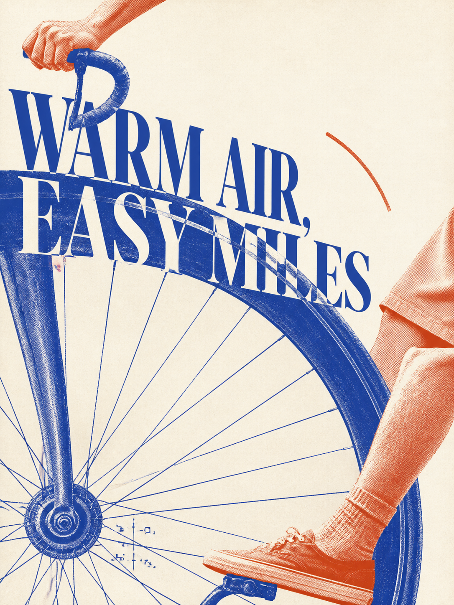 | 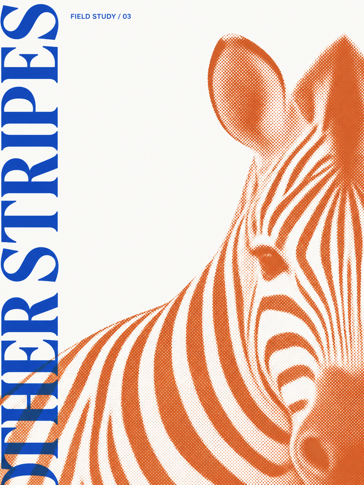 | 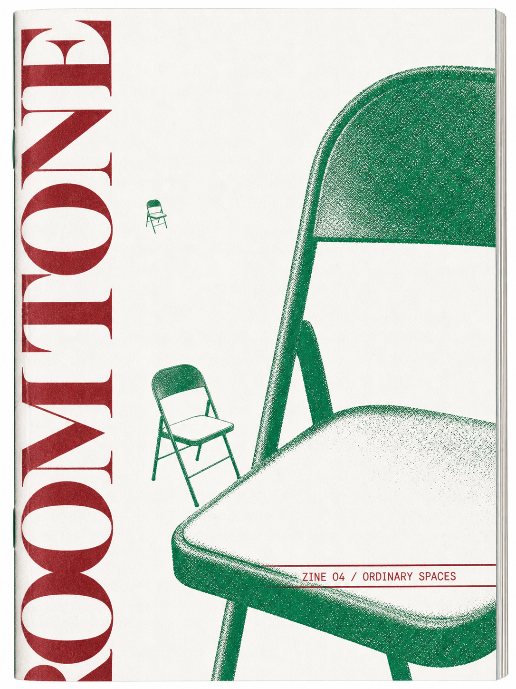 |

| 沙丁鱼包装 | 耳机包装 | 防晒包装 |
|:---:|:---:|:---:|
| 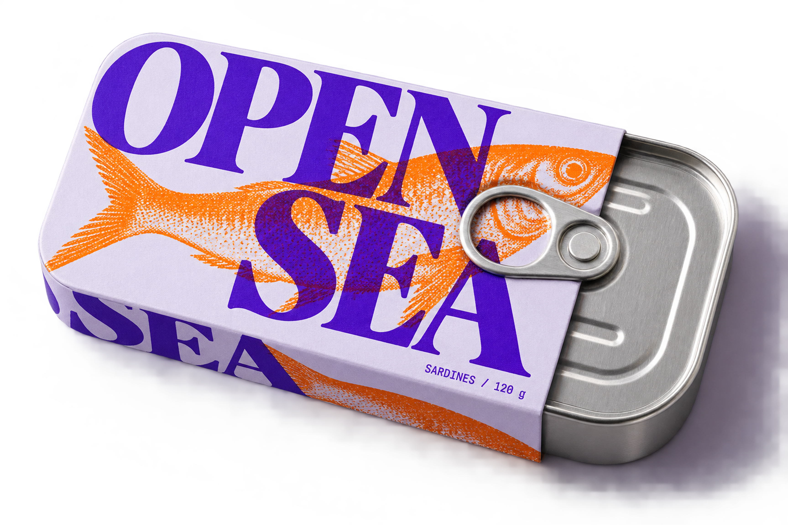 | 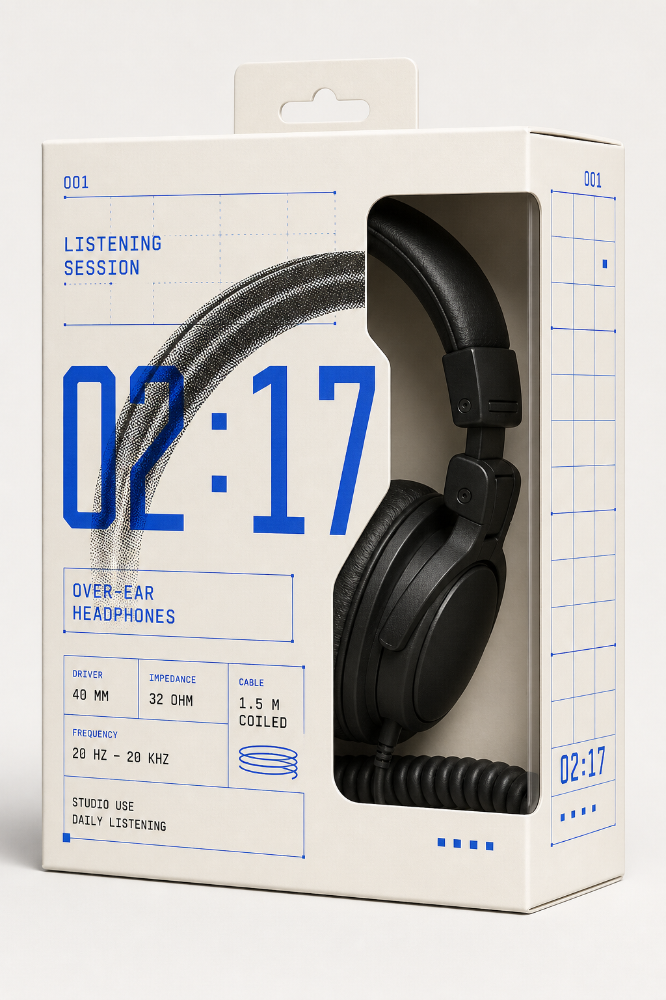 | 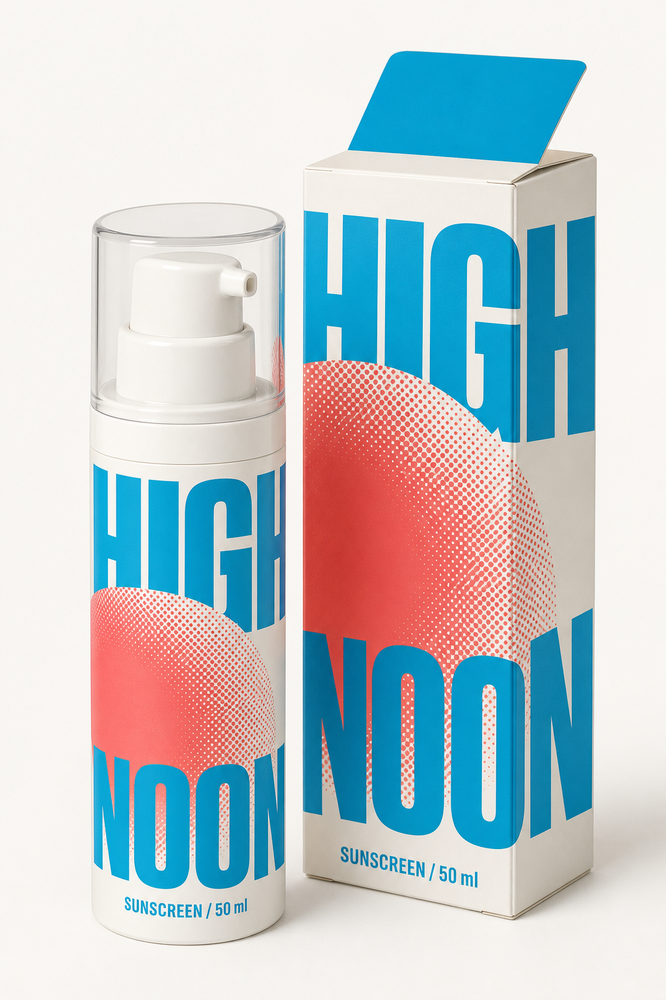 |

| 留一点温度 | 品牌周边 | 慢叶茶 |
|:---:|:---:|:---:|
| 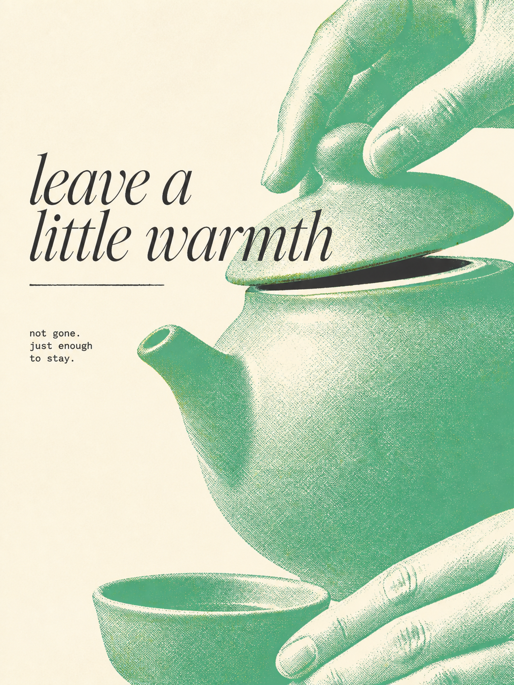 | 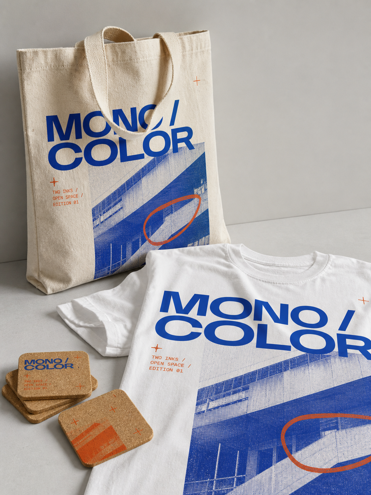 |  |

| 夜里还有什么 | 周日收音机 | 夜市 |
|:---:|:---:|:---:|
| 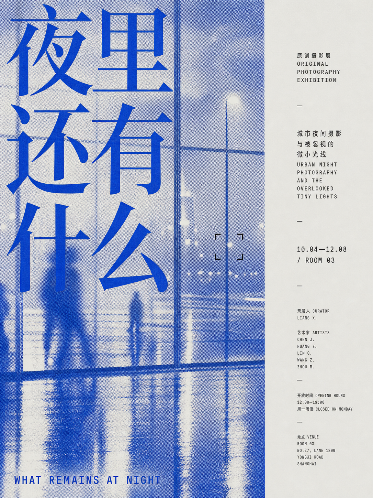 | 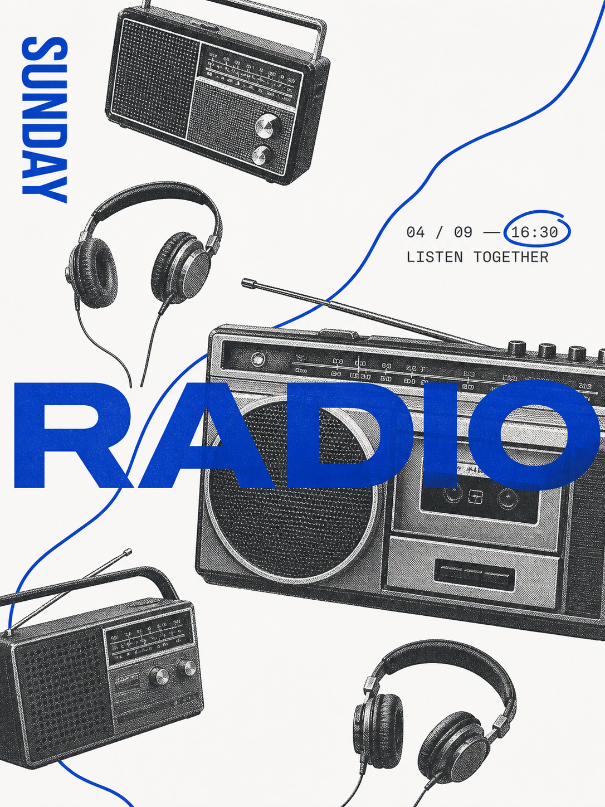 | 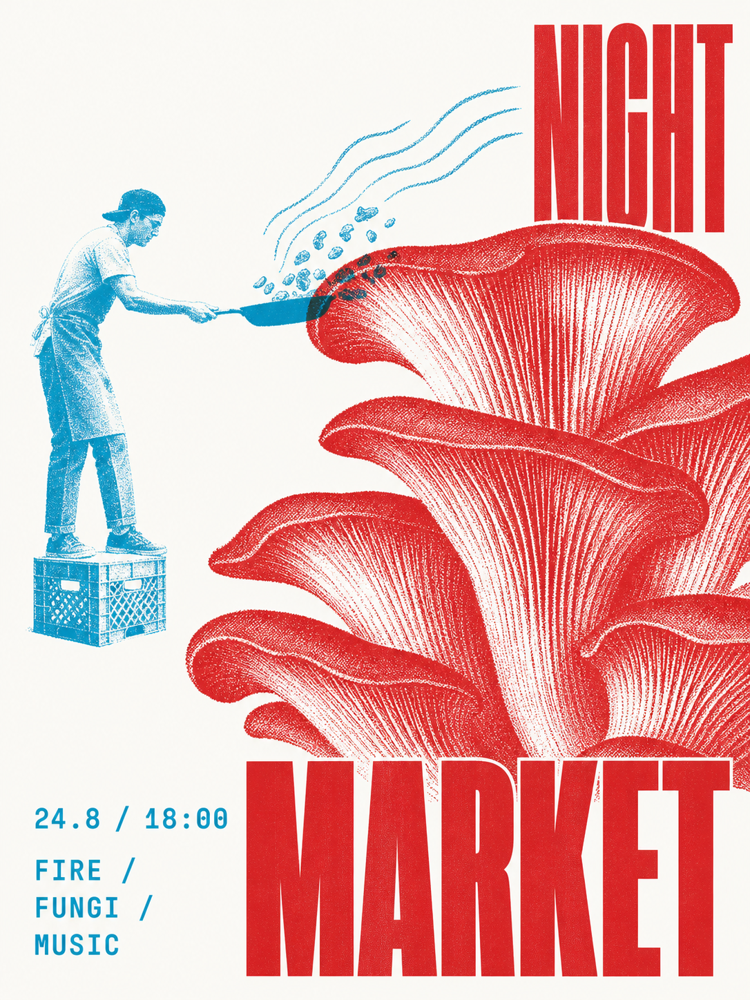 |

这十二张原创生成示例用于展示 skill 的能力范围，是输出案例，不是供复刻的模板。

## 视觉参考与署名

视觉系统的研究基于一组 12 张参考图片。完整图片清单、研究笔记、署名状态与纠错入口见 [Visual References and Attribution](./REFERENCES.md)。第三方参考作品的版权归各自创作者与权利人所有。

| 01 | 02 | 03 |
|:---:|:---:|:---:|
| <a href="./examples/reference-01.png"></a> | <a href="./examples/reference-02.png"></a> | <a href="./examples/reference-03.png"></a> |
| 04 | 05 | 06 |
| <a href="./examples/reference-04.png"></a> | <a href="./examples/reference-05.png"></a> | <a href="./examples/reference-06.png"></a> |
| 07 | 08 | 09 |
| <a href="./examples/reference-07.png"></a> | <a href="./examples/reference-08.png"></a> | <a href="./examples/reference-09.png"></a> |
| 10 | 11 | 12 |
| <a href="./examples/reference-10.png"></a> | <a href="./examples/reference-11.jpg"></a> | <a href="./examples/reference-12.jpg"></a> |

## 它能做什么

| 系统 | 方向 |
|---|---|
| **输入** | 主题、短句、物件、文章想法或用户提供的照片 |
| **配色** | 自适应中性白、冷灰或淡米色 + 默认受控双色；明确单色请求保持单墨 |
| **模式** | 纯单色、彩色 + 黑墨、互补双色或叠印双色 |
| **图像** | 网点、孔版颗粒、蓝晒曝光感或复印机破碎质感 |
| **留白** | 25%–55% 可见纸面，采用非对称编辑网格 |
| **字体** | 根据内容选择文学衬线、文化几何体、窄体公共标题、数字信息体、旋转纵排、手写插话或文字物件 |
| **输出** | 生成位图、完整生产 Prompt 与简短配方说明 |

## 适用场景

- 海报：活动、party、艺术展、城市散步、观念海报
- 社交媒体：小红书封面、公众号头图、播客封面、文化评论插图
- 品牌物料：明信片、邀请函、门票、节目单、菜单、包装贴纸
- 纪念物：旅行札记、照片册封面、日期纪念卡
- 书籍与刊物：封面、扉页、章节页、zine 内页
- 文字：文学短句、诗歌、个人宣言

这些场景都能利用单墨色降低制作成本，同时保留鲜明识别度。

## 工作方式

```text
1  读取输入      →  确定主体、意图、文字与图像角色
2  选择版式      →  图像、标本、文字宣言、物件场、叠印拼贴、编辑日志或封面
3  分配印版      →  默认两块职责明确的印版；明确要求单色时切换为一块
4  组织画面      →  保留 25%–55% 留白，并加入一个有意的打破点
5  生成并检查    →  核对油墨数量、主体身份、层级、材质与原创性
```

## 油墨系统

**单色主题：**钴蓝、皇家蓝、植物绿、薄荷绿、陶土橙、信号红、茄紫与炭黑。

| 图例 | 油墨 | Hex |
|---|---|---|
|  | 钴蓝 / 群青 | `#2148B8` |
|  | 皇家蓝 | `#2058D4` |
|  | 植物绿 | `#008A4B` |
|  | 薄荷绿 | `#5EB783` |
|  | 陶土橙 | `#C65F38` |
|  | 信号红 | `#C83232` |
|  | 茄紫 | `#63365F` |
|  | 炭黑 | `#30343A` |

**双色配方：**粉蓝 + 信号红、钴蓝 + 陶土橙、植物绿 + 酒红、炭黑 + 信号红、电光蓝 + 碳黑、薄荷绿 + 炭黑、群青 + 安全橙、青蓝 + 砖红、橘色 + 灰蓝。

| 图例 | 双色配方 | Hex |
|---|---|---|
|  | 粉蓝 + 信号红 | `#9EB8D3` + `#C83232` |
|  | 钴蓝 + 陶土橙 | `#2148B8` + `#C65F38` |
|  | 植物绿 + 酒红 | `#008A4B` + `#8F3434` |
|  | 炭黑 + 信号红 | `#30343A` + `#C83232` |
|  | 电光蓝 + 碳黑 | `#173AE3` + `#242321` |
|  | 薄荷绿 + 炭黑 | `#5EB783` + `#302D2E` |
|  | 群青 + 安全橙 | `#263E99` + `#E55D2B` |
|  | 青蓝 + 砖红 | `#159DDA` + `#B64032` |
|  | 橘色 + 灰蓝 | `#E46C2D` + `#4773A5` |

双色作品通常由主墨承担 70%–85% 的印刷面积，辅墨承担 15%–30%，并只负责日期、注释、特定物件或叠印交叉等明确任务。背景基材不算第三色，两块印版重叠后形成的深色也不算第三种油墨。

**背景自适应，不默认怀旧：**中性白 `#FAFAF7` 适合清爽的文化、社交、活动与彩色主图；冷灰 `#E9E9E5` 适合建筑、科技、炭黑体系与克制品牌；淡米色 `#F5F1E8` 适合触觉、旅行、食物、亲密、档案或明确要求怀旧的主题。限制油墨和使用网点，并不等于自动复古。

## 视觉规则

1. **最多使用两种印刷油墨。** 默认受控双色：主墨占 70%–85%，辅墨占 15%–30%，各自承担明确职责；明确单色请求使用一块印版。
2. **纸张必须可见。** 结果应像真实印刷页面，而不是数字化单色滤镜。
3. **机械复制质感优先。** 照片要转成网点、颗粒、断裂高光、积墨和印版之间的轻微套印偏移。
4. **留白参与叙事。** 空白纸面占画布的 25%–55%，用于控制阅读节奏。
5. **字体必须有张力，也允许变化。** 每张选择一种符合内容的主字体骨架和一种功能字体；手写只作为可选的短插话。一组作品可以改变主字体类别，不必重复同一种固定处理。
6. **主体身份保持不变。** 用户提供的人物、物件和场景必须可辨认。
7. **参考图是语法，不是模板。** 相对每张参考图，至少改变四个结构变量。

## 不做这些

- 不是给全彩照片套一个单色滤镜
- 不是随意的双色装饰，也不使用两块以上的印版
- 不是光滑样机、3D 渲染、渐变海报或电影感场景
- 不是居中模板、卡片网格、贴纸拼贴或装饰色块系统
- 不是密集的剪贴簿 Grunge 或撕纸风格
- 不因网点或限制色自动加入泛黄、棕褐、破旧边框、怀旧物件或复古字体
- 不写营销文案，不虚构品牌、赞助商、网址或二维码
- 不复刻参考海报，也不模仿艺术家签名

## 安装

克隆到 Claude Code 的 skills 目录：

```bash
git clone https://github.com/yanliudesign/mono-color-skill.git \
  ~/.claude/skills/mono-color
```

安装后重启 Claude Code。其他 Agent 环境可以直接把 [`SKILL.md`](./SKILL.md) 作为 skill 入口加载。

## 试一试

```text
用 mono-color 做一张关于凌晨便利店的竖版海报，文案是“still open”。
```

```text
把这张人物照片做成钴蓝单色编辑 Zine 封面，保留人物身份和表情。
```

```text
做一张蕨类植物主题的绿色孔版观察笔记，标题是“field note 07”。
```

```text
用群青 + 安全橙做一张城市骑行叠印海报，让自行车与超大标题在局部交叉。
```

```text
把这个产品做成青蓝 + 砖红的重复物件封面，为标题和事实型小字保留一块空白区域。
```

```text
做一张信号红单色屋顶 party 海报，主标题是“日落之后”，日期保持小号。
```

```text
做一张混凝土建筑主题的炭黑 + 信号红艺术展海报，红色只用于日期、地点和一个几何打破点。
```

```text
把这张街景照片做成钴蓝单色城市散步海报，将建筑处理成粗网点，标题是“向北步行”。
```

```text
做一张周末跳蚤市场主题的陶土橙小红书封面，使用一个超大中文标题，并保留至少三分之一空白纸面。
```

```text
把这张主持人肖像做成茄紫单色播客封面，保留面部辨识度，单集标题是“安静的一小时”。
```

```text
为独立书店开幕设计一张植物绿 + 酒红邀请函：绿色负责纸张质感与图像，酒红只负责活动信息。
```

```text
把这些旅行照片做成一组钴蓝 + 陶土橙明信片，整组使用同一网格，但改变每张的裁切与手写批注。
```

```text
为诗句“我们一直开着窗”设计一张薄荷绿 + 炭黑扉页，不使用照片，保留大量纸面，只加一条档案式小注释。
```

## 交付格式

每次运行返回：

1. 在有图像生成工具时生成一张位图；
2. 实际使用的完整生产级 Prompt；
3. 一份配方说明，列出印刷模式、准确油墨配方、版式家族、字体搭配、印刷工艺与原创性变化。

如果当前环境不能生成图像，skill 会明确说明限制，并提供可直接使用的生产级 Prompt。

## 稳定性与验证

生成 Prompt 前，skill 会先把每次请求解析成固定的 recipe manifest。用户未指定时，统一采用 `3:4` 比例、中性白背景、当代 Editorial 方向、35% 留白，以及确定性的配色和版式选择规则；主图和油墨需要时可切换为冷灰或淡米色。输入照片默认采用保真再现；当用户要求抽象、艺术、松弛、实验性或降低写实度时，会切换为确定性的符号提取，并保留 2-4 个身份锚点。用户的明确要求仍然优先，但不能突破双色上限与原创性规则。

`design-system/` 目录把视觉语法变成可以复用、检查的数据，分别保存颜色 token、字体角色、构图几何、载体识别信号、视觉节奏和受控印刷偏差。参考板、生成配方和校验器共用同一套 ID，避免视觉规则只存在于描述性文字里。

`design-system/rhythm.json` 把“松弛感”定义为不均匀的能量分布，而不是统一降低强度。每张作品选择一个大胆的主视觉事件，例如超大文字、极端裁切、巨大局部、集中叠印或异常尺度；其他区域通过纸面、浅网点和稀疏功能文字主动释放。无参考照片的人物默认拆成 2–4 个识别锚点与局部裁切，避免完整图库人物和安全的“左标题、右照片”构图。留白比例与未收口边缘都由主视觉事件决定，不再强制固定数值。

“可控偶然”只发生在印刷表现层：当代 Editorial 选择 0–2 种克制效果；触觉、复古或档案做旧方向选择 2–3 种有边界的效果，例如油墨浓淡、干墨破边、网点漂移、套印偏移或一处断开的手工笔触。相同输入会复现同样的偏差，同时不移动核心构图、不损伤文字可读性。

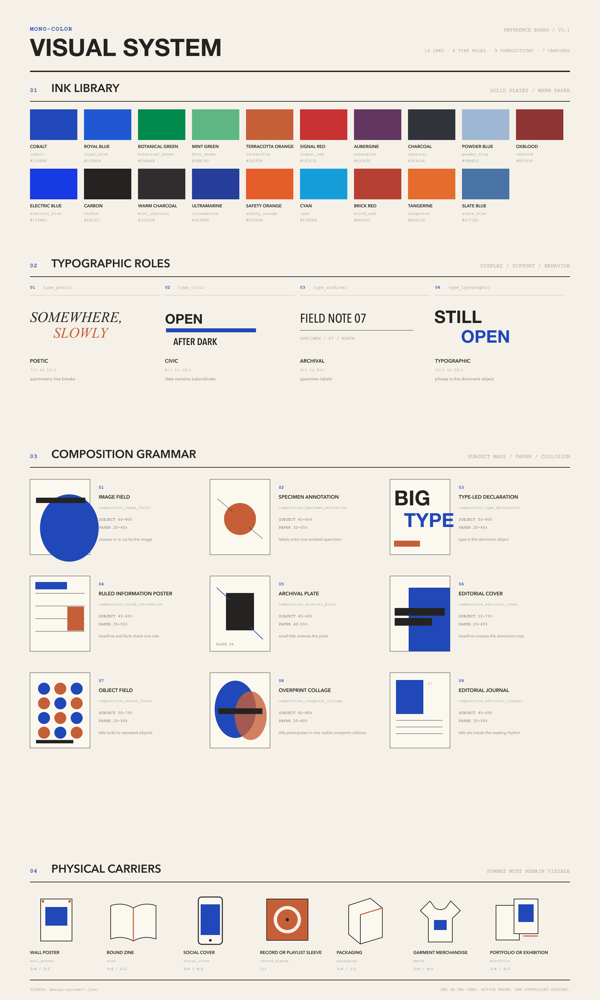

四张专项参考分析板分别记录字体、颜色、排版和风格证据：

### 字体

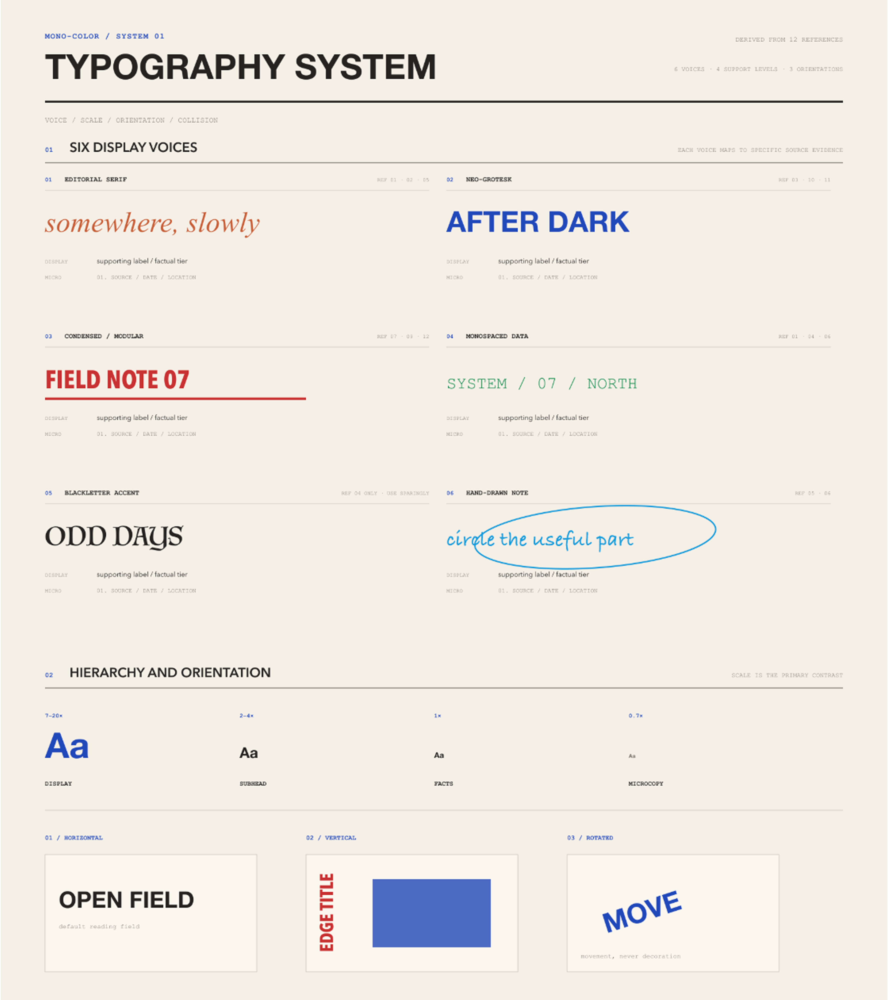

### 颜色

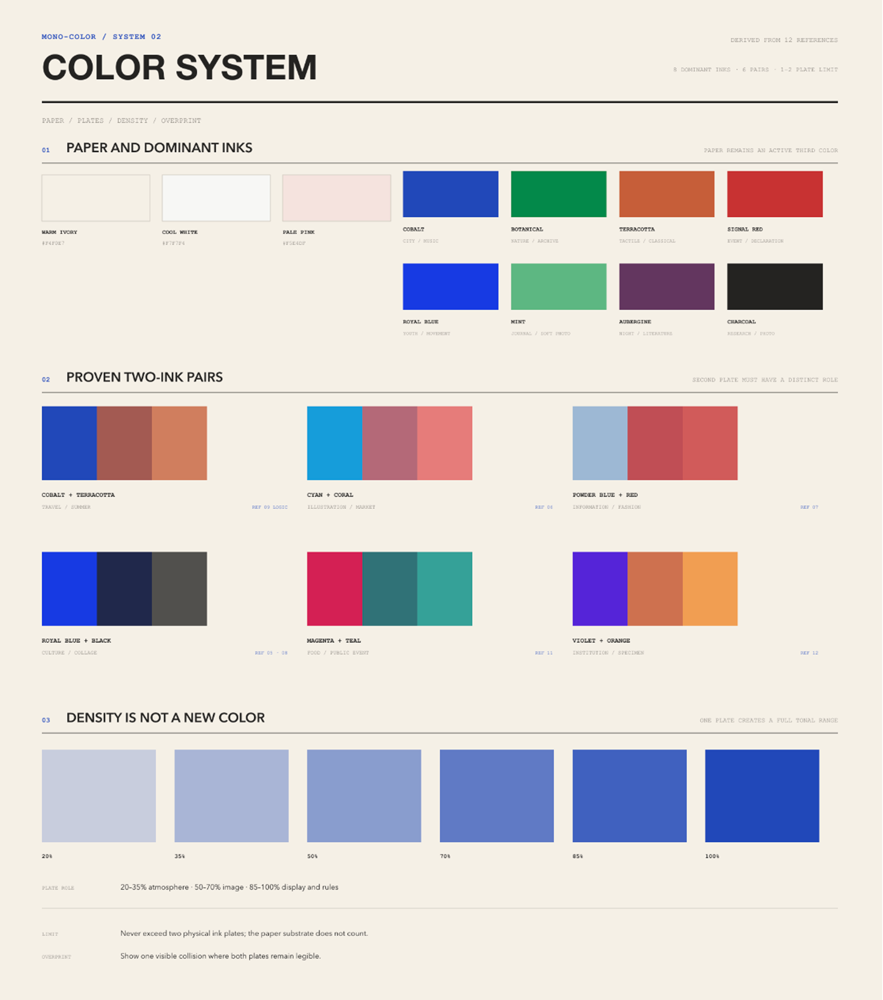

### 排版

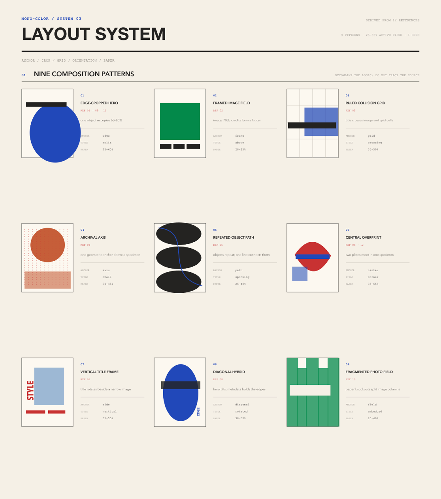

### 风格

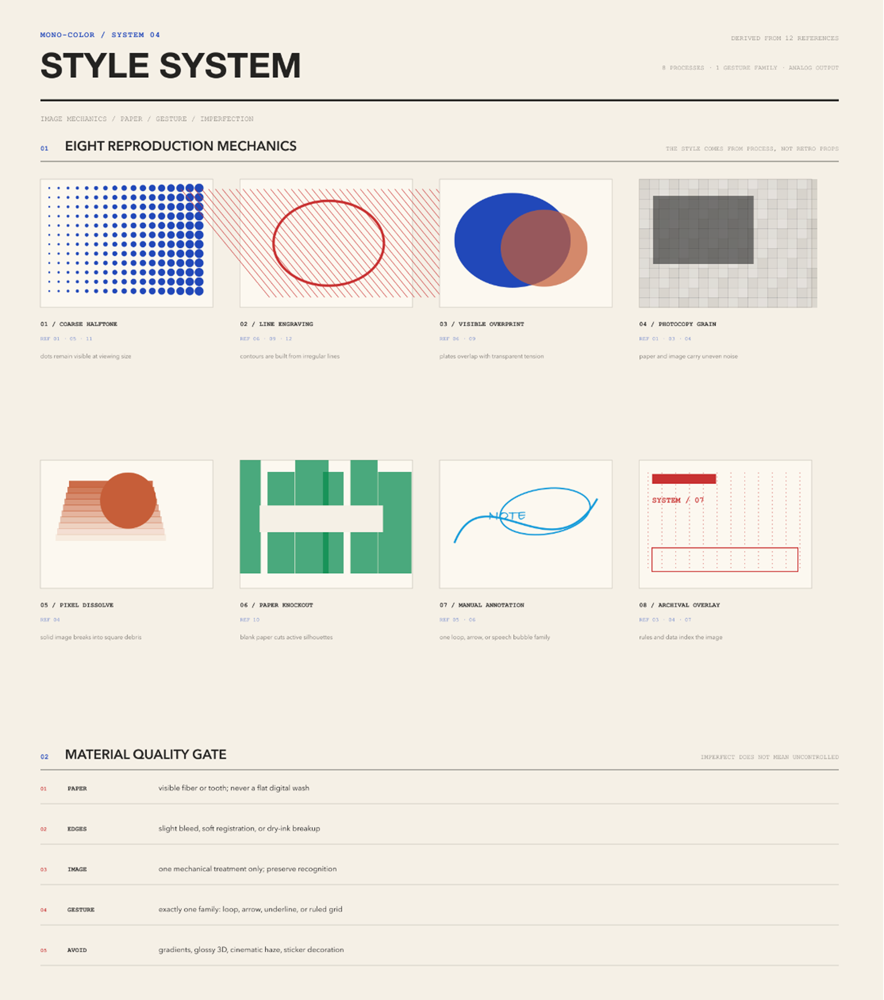

修改 catalog 后，可以重新导出由 catalog 驱动的综合总表：

```bash
python3 scripts/build_design_system_board.py
```

评测契约覆盖默认输入、人物照片、植物主题、双色叠印、活动信息、长文本、仅输出 Prompt、颜色冲突、重复物件和照抄参考图等情况。本地运行：

```bash
python3 scripts/validate_evals.py
python3 scripts/validate_design_system.py
```

每次 pull request 和推送到 `main` 时，GitHub Actions 都会运行同一套检查。

## 仓库结构

```text
mono-color-skill/
├── .github/workflows/ # 持续验证
├── design-system/    # 机器可读的颜色、构图、节奏与印刷模式
├── examples/         # README 中展示的原创生成示例
├── scripts/          # 评测与设计系统校验脚本
├── swatches/         # 单色与双色色板
├── SKILL.md          # 触发规则、视觉系统、工作流与质量门槛
├── README.md         # 英文说明
├── README.zh.md      # 中文说明
├── CHANGELOG.md      # 版本记录
└── evals/
  ├── evals.json    # 典型触发语与确定性断言
  └── schema.json   # 评测契约 Schema
```

## 原创性

这个 skill 提取的是配色、印刷工艺、空间密度、字体层级和沟通语气等系统特征。它不会复制参考图的构图、文案、标签、Logo、边框系统或标志性排列。

当用户提供照片时，主体身份会被保留，但裁切、网点、网格、文字位置和信息标注都会重新设计。

## 许可证

源代码、Skill 指令和脚本采用 [MIT License](./LICENSE)。

[`examples/`](./examples) 目录中由 Yan Liu 创作的原创示例 © 2026 Yan Liu，不包含在 MIT License 中；12 张第三方研究参考图的版权归各自创作者与权利人所有。详见[视觉资产许可证](./ASSET-LICENSE.md)与[视觉参考和署名](./REFERENCES.md)。

---

Created by [Dreameryanyan](https://www.linkedin.com/in/yanliudesign/) · [LinkedIn](https://www.linkedin.com/in/yanliudesign/) · [X](https://x.com/yanliudreamer)
