# Visual References and Attribution

These twelve third-party images informed the visual analysis behind mono-color. They are shown for research, commentary, and attribution, not as templates to reproduce. Copyright remains with the respective creators and rights holders.

The original external URLs and creator names were not preserved when these files were first collected. Rather than invent attribution, this page marks those fields as unverified. If you recognize a work, please [open an attribution correction](https://github.com/yanliudesign/mono-color-skill/issues/new?title=Reference+attribution+correction&body=Reference+number%3A%0ACreator%3A%0AOriginal+work+URL%3A%0AEvidence%3A) with the creator, canonical work URL, and supporting evidence.

## Reference Set

| Reference | Research notes | Original source |
|---|---|---|
| <a href="./examples/reference-01.png">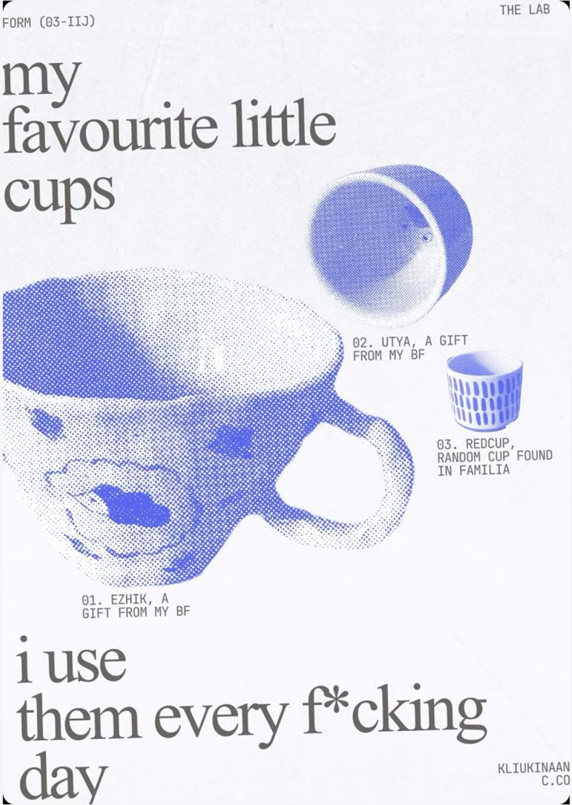</a> **01** | Oversized serif, object annotations, coarse blue halftone, edge-cropped hero object | [Pinterest record](https://www.pinterest.com/pin/772930354843998787/) (image verified; pin by kliukinaan) |
| <a href="./examples/reference-02.png">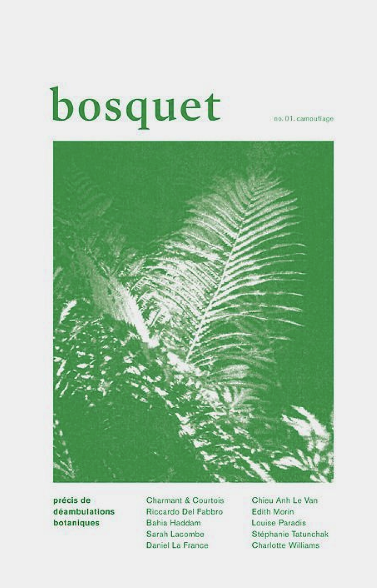</a> **02** | Lowercase serif masthead, botanical one-ink photograph, framed editorial cover | **Unverified:** original URL was not preserved |
| <a href="./examples/reference-03.png">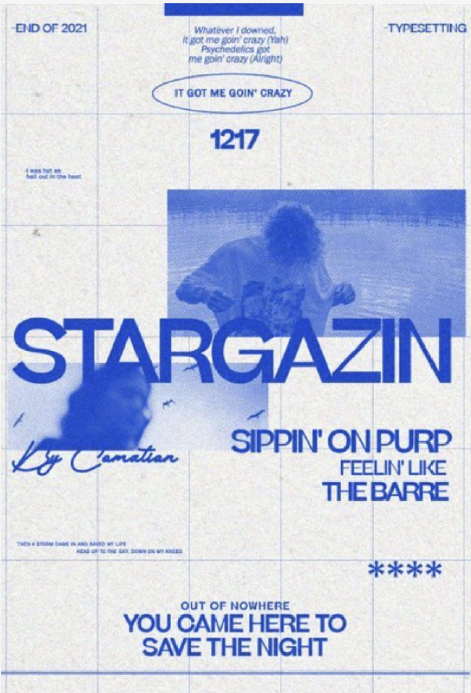</a> **03** | Oversized grotesk across photographs, modular grid, cobalt photocopy texture | [Pinterest record 1](https://www.pinterest.com/pin/772930354844205058/) · [Pinterest record 2](https://www.pinterest.com/pin/772930354844116748/) (image verified) |
| <a href="./examples/reference-04.png">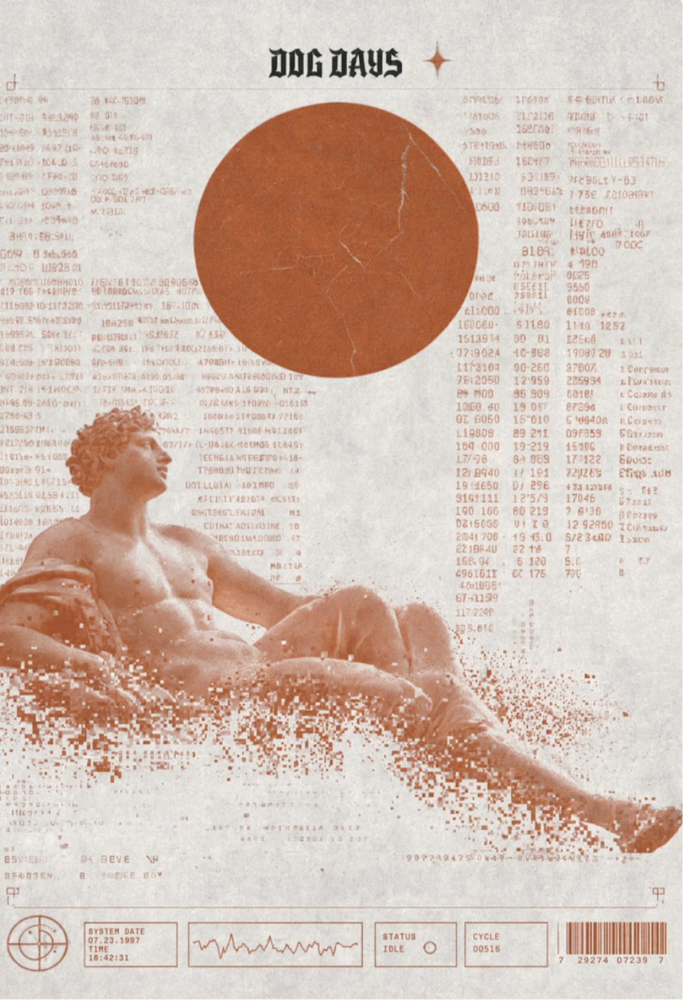</a> **04** | Blackletter label, machine data, terracotta archival-terminal treatment | **Unverified:** original URL was not preserved |
| <a href="./examples/reference-05.png">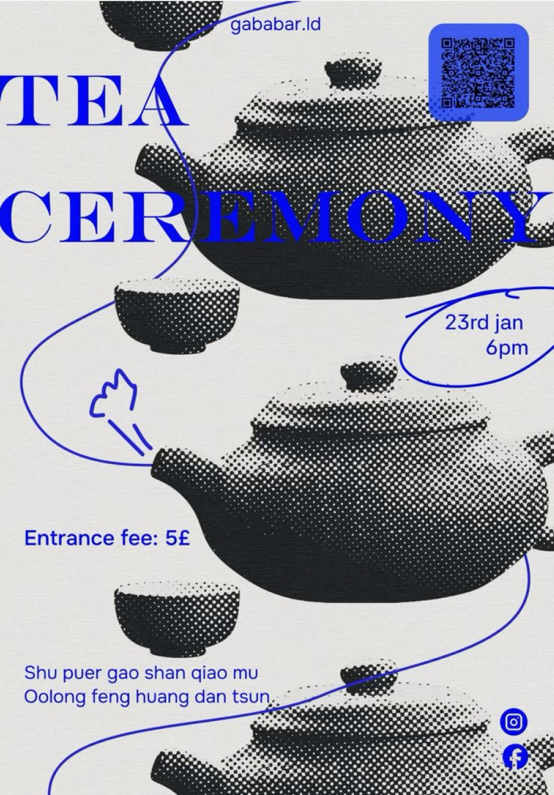</a> **05** | Giant Didone serif, repeated objects, coarse halftone, blue marker path | [Pinterest record](https://www.pinterest.com/pin/772930354844206833/) (teapot reference; user confirmed) |
| <a href="./examples/reference-06.png">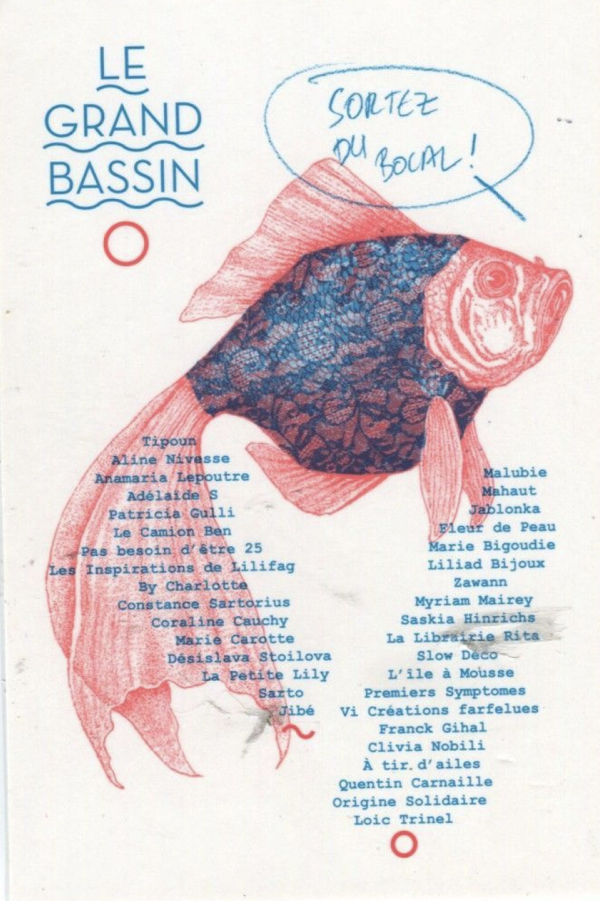</a> **06** | Geometric wordmark, cyan-coral engraving, text shaped around a specimen | [Pinterest record](https://www.pinterest.com/pin/1105493039766574425/) (image verified) |
| <a href="./examples/reference-07.png">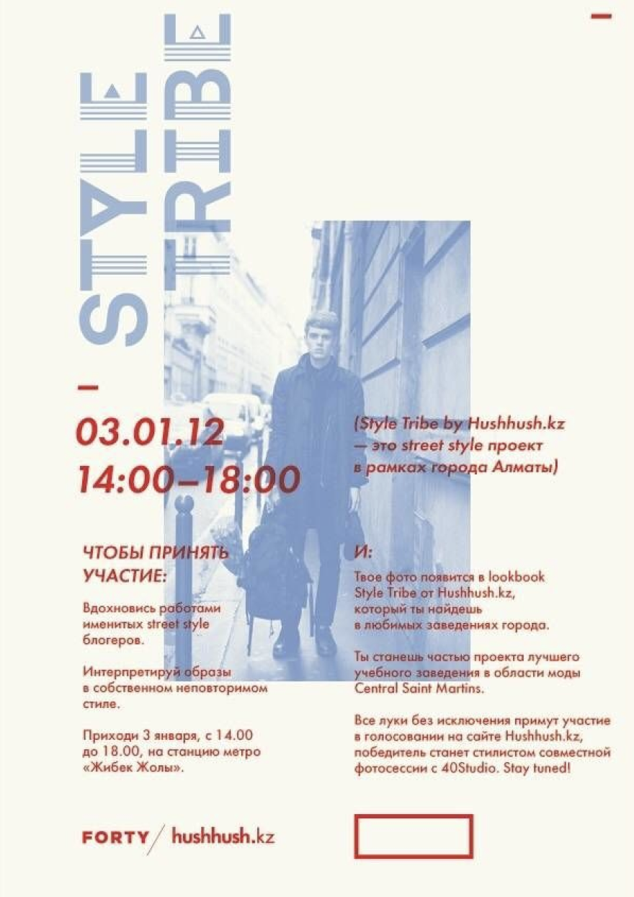</a> **07** | Rotated display title, powder-blue photograph, red information plate | [Pinterest record](https://www.pinterest.com/pin/684195368407686076/) (image verified; saved from Designspiration) |
| <a href="./examples/reference-08.png">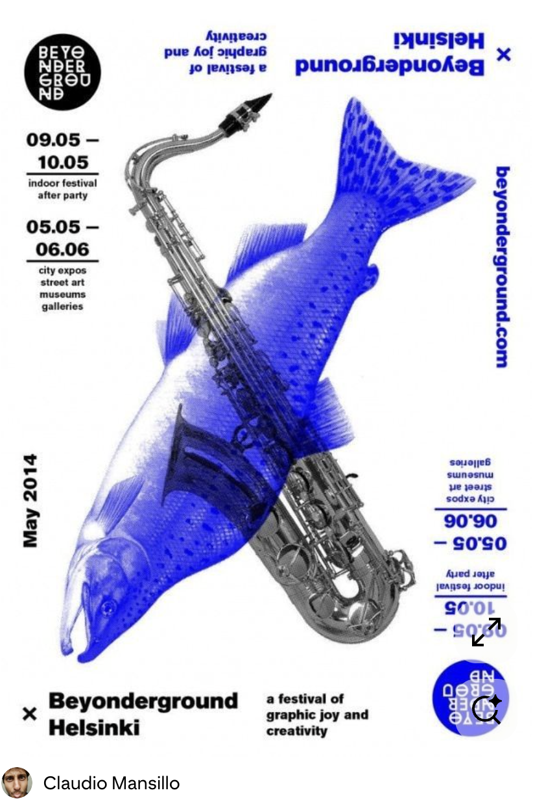</a> **08** | Heavy grotesk, diagonal object collision, royal-blue and black composite | [Pinterest record](https://www.pinterest.com/pin/772930354844205904/) (image verified; pin saved by Claudio Mansillo) |
| <a href="./examples/reference-09.png">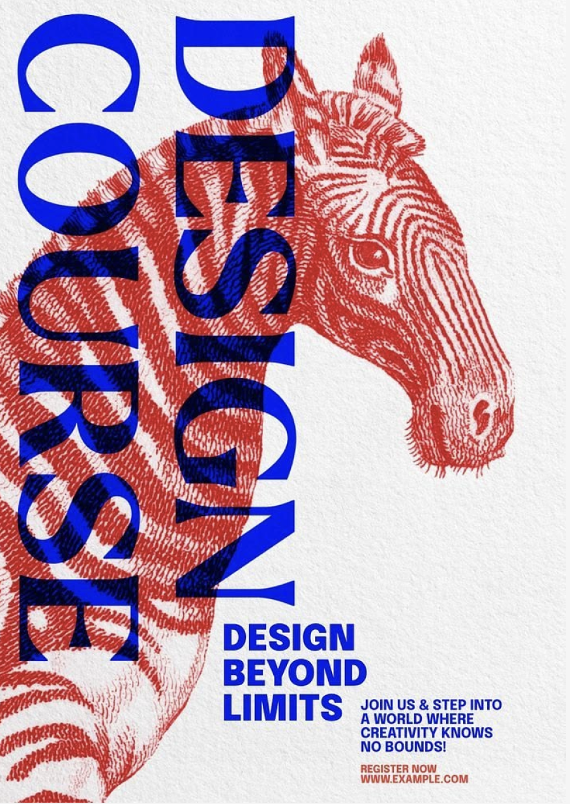</a> **09** | Condensed capitals, vertical display type, cobalt-red engraving overprint | [Pinterest record](https://www.pinterest.com/pin/772930354844205908/) (image verified; pin credits rawpixel.com and dunno design lab) |
| <a href="./examples/reference-10.png">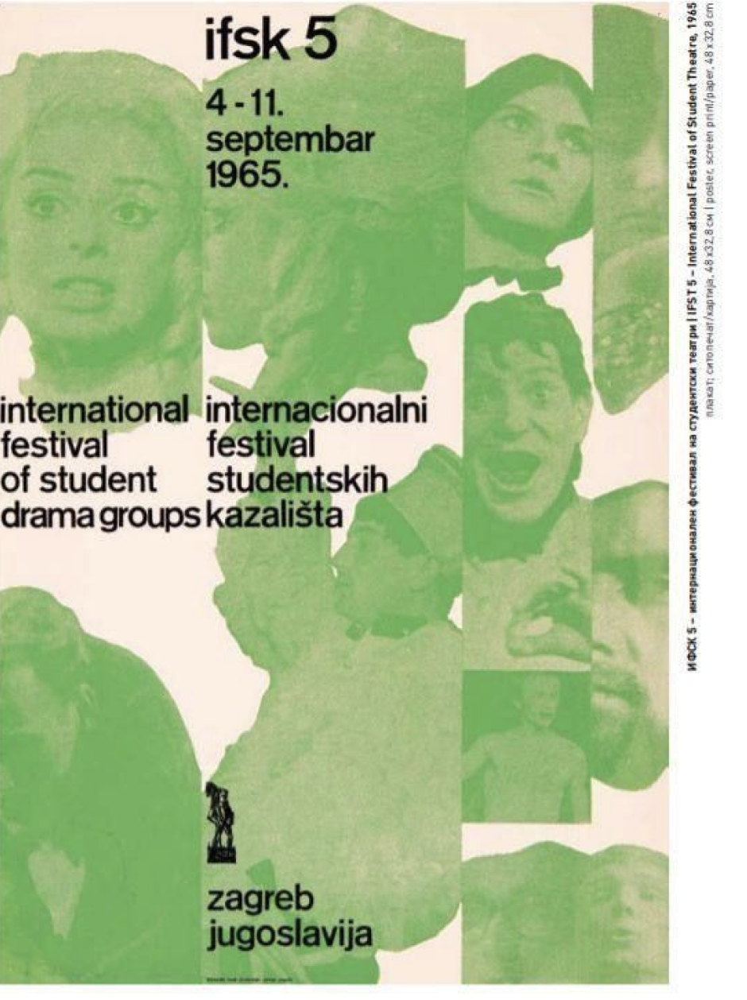</a> **10** | Neutral grotesk, fragmented portrait columns, green-black collage on pink | **Unverified:** original URL was not preserved |
| <a href="./examples/reference-11.jpg">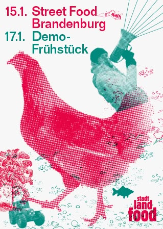</a> **11** | Heavy date labels, magenta-teal animal halftone, small diagram marks | [Pinterest record](https://www.pinterest.com/pin/772930354844205927/) (image verified; pin identifies Daniel Wiesmann Büro für Gestaltung) |
| <a href="./examples/reference-12.jpg">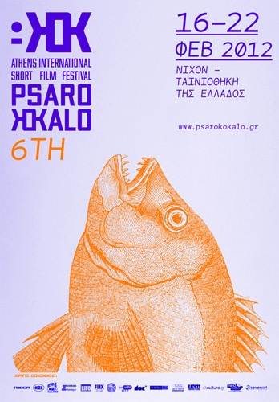</a> **12** | Modular display mark, violet-orange engraving, institutional event layout | [Psarokokalo 2012 event article](https://camerastyloonline.wordpress.com/2012/02/14/psarokokalo-2012/) (image verified; poster creator unverified) |

## Unmatched Historical Links

These supplied Pinterest URLs currently return “We can’t find that idea,” so they cannot be matched responsibly without another screenshot or archived page:

- https://www.pinterest.com/pin/772930354844205012/

## 中文说明

以上 12 张第三方图片用于记录 mono-color 的视觉研究脉络，不是供复刻的模板。作品版权归各自创作者与权利人所有。

这些图片最初被收集时，仓库没有保存原始网页链接和作者姓名。为了避免错误署名，本页暂时将来源标记为“待核实”。如你知道某张作品的作者与原始发布页，请通过上方 attribution correction 链接提交证据，核实后会及时补全。